# 🎓 EduExcellence Tuition Management System

> A custom-built tuition management system designed to automate and streamline the workflow of small-scale tutors.

**Website** https://www.eduexcellencetutorial.com

**EduExcellence** is a freelance side-project aimed at solving real-world problems faced by educators who manage classes manually. From scheduling to progress tracking, this system brings structure, automation, and ease-of-use to the tutoring process.

---

## 🧩 Features

✅ **Automated Google Meet Link Generation**  
✅ **Scheduled Email Notifications**  
✅ **Batch, Board, Subject & Chapter Management**  
✅ **Attendance Tracking**  
✅ **Student Progress Monitoring (Chapter-wise)**  
✅ **Notes Builder & Sharing**  
✅ **Admin & Student Dashboards**

---

## 🖼️ Screenshots

Here are a few screenshots of the system:


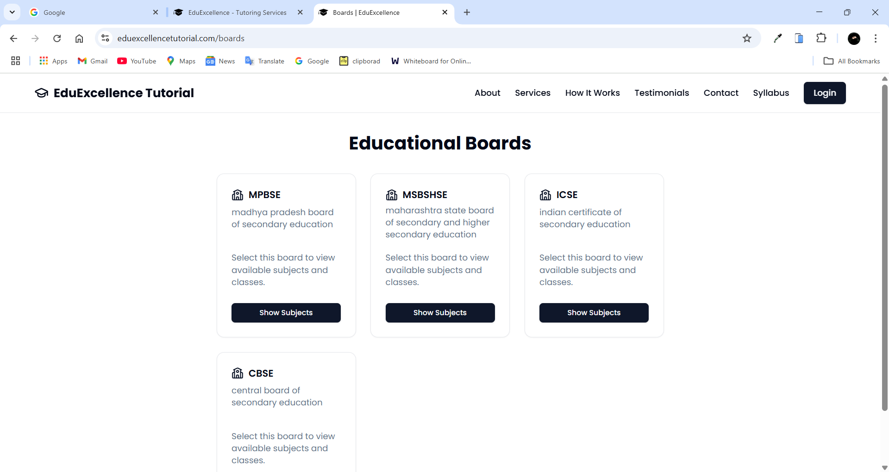
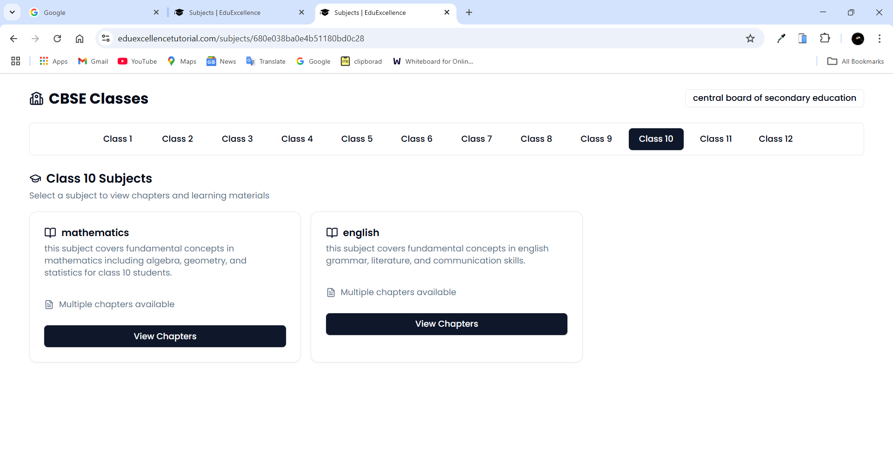
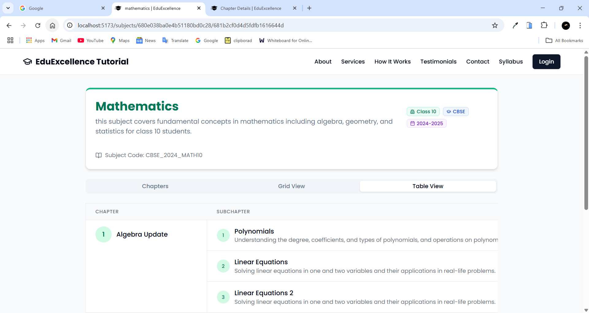
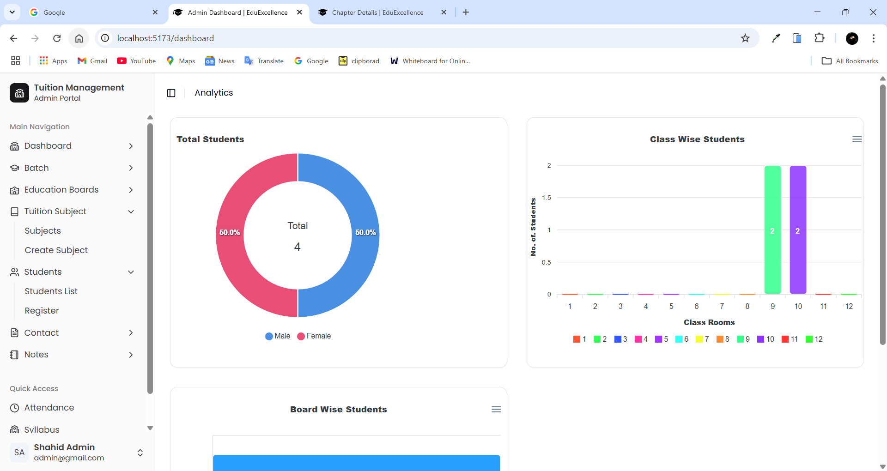
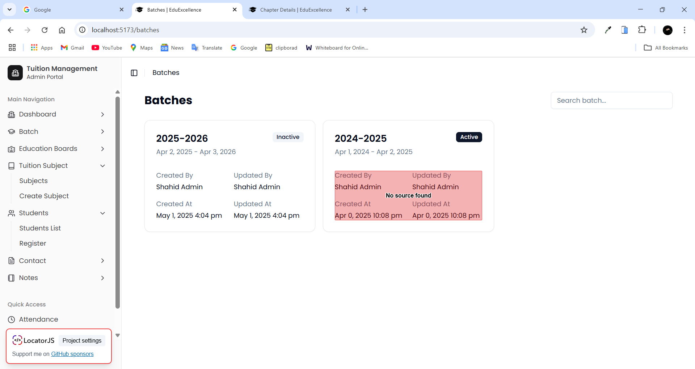
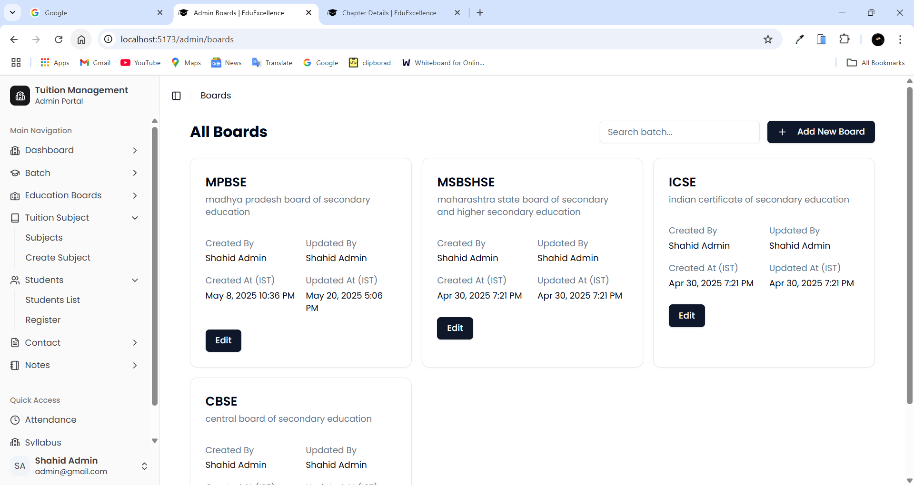
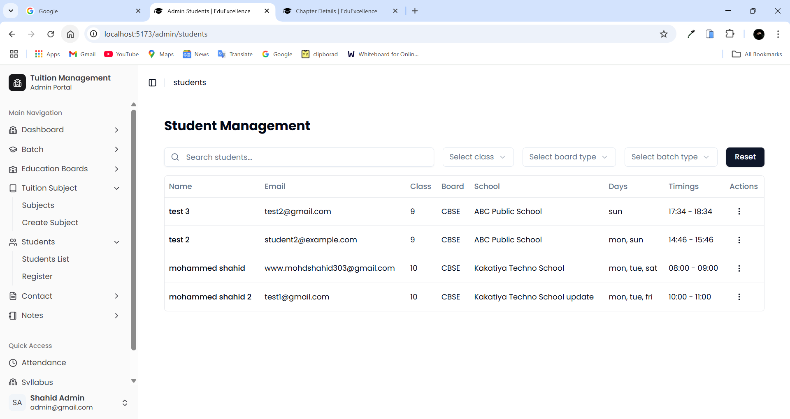
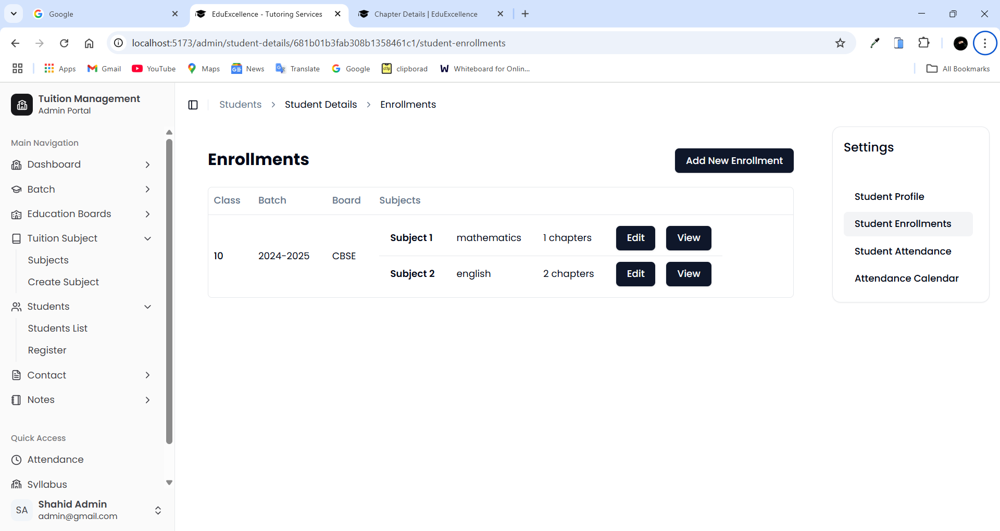
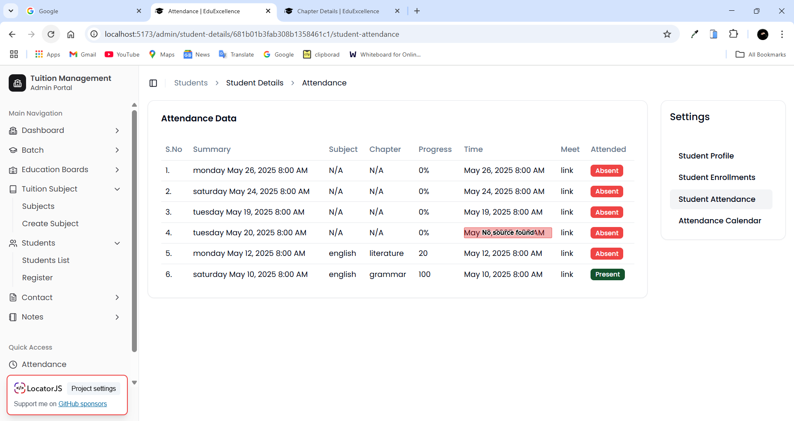
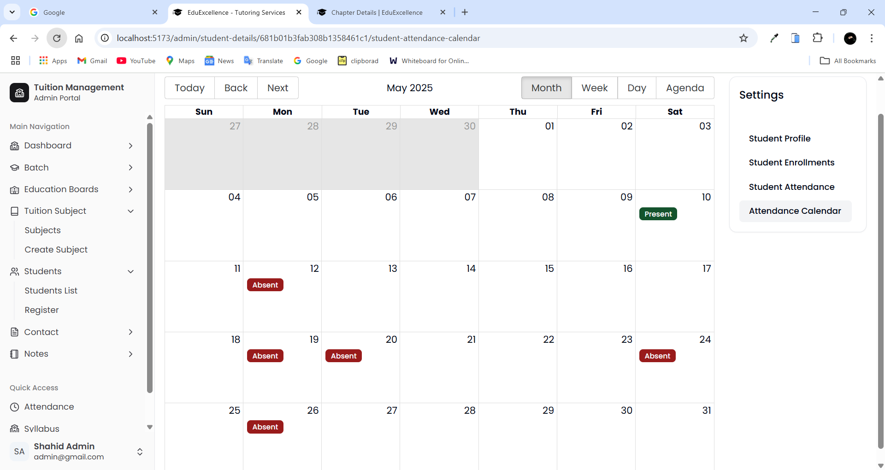
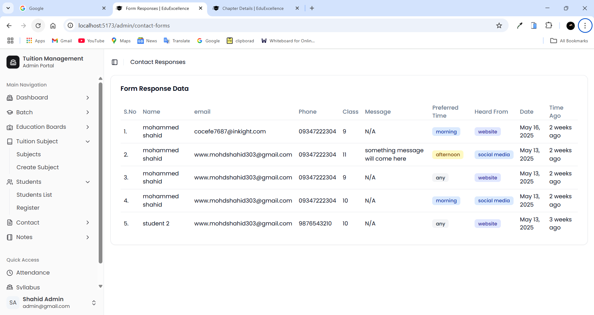
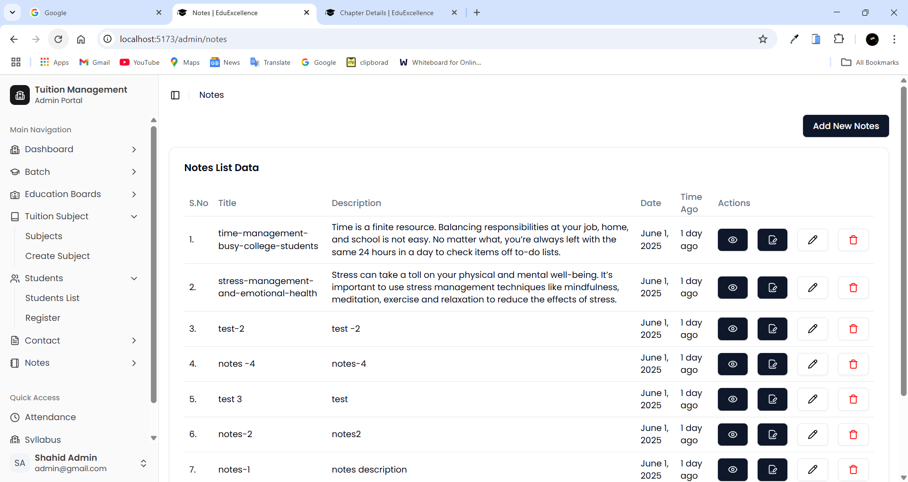
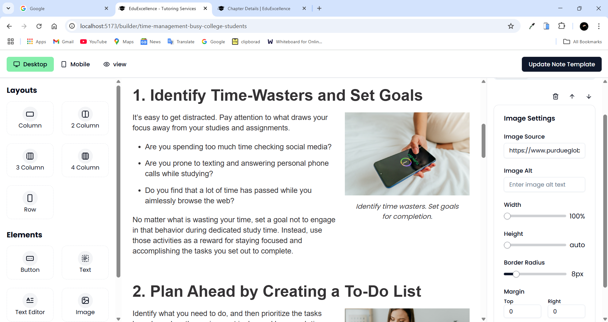

## ⚙️ Tech Stack

Currently, the exact stack used in this MVP is not publicly disclosed. However, based on functionality, it likely includes:

- Frontend: HTML, CSS, JavaScript / React / Tailwindcss / Shadcn
- Backend: Node.js
- Database: MongoDB
- Integrations: Google Meet API, Email APIs (like Nodemailer and AWS SES)

---

## 🛠️ Installation

To run this project locally, follow these steps:

1. **Clone the repository**
   ```bash
   git clone https://github.com/mohammedshahid096/tutuion_management.git
   ```
